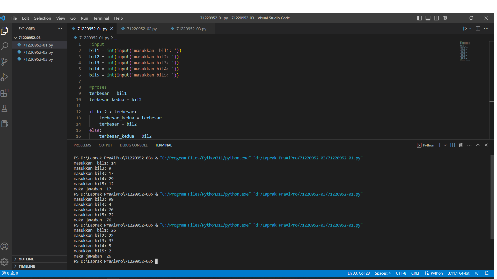
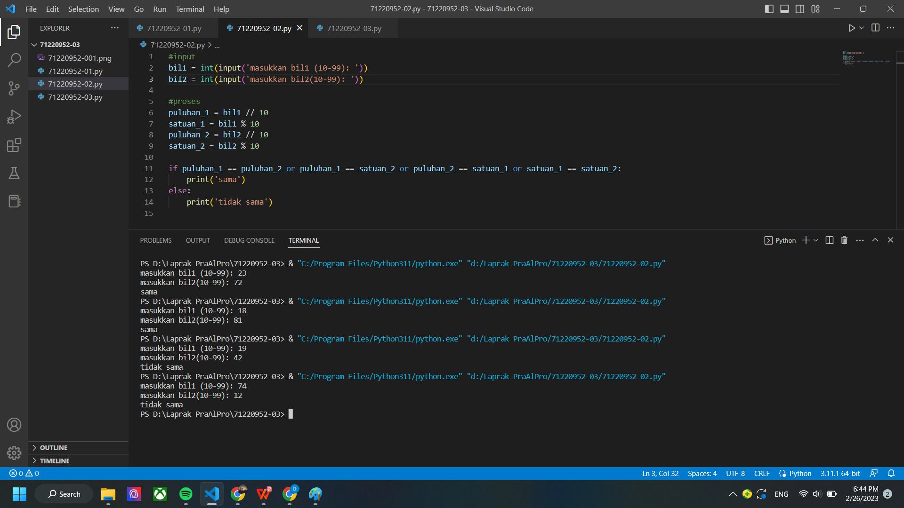
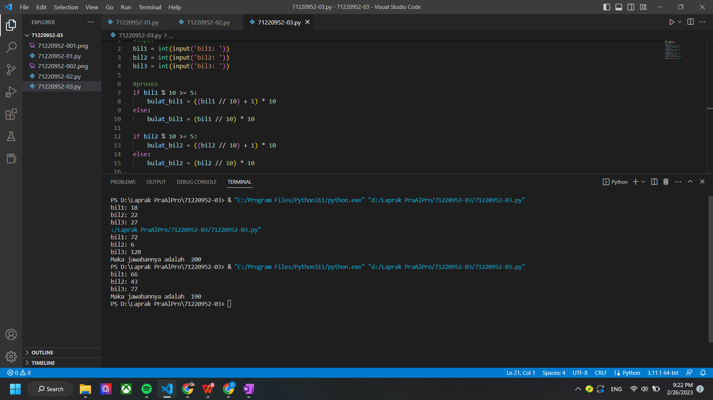

# Laporan Praktikum Algoritma dan Pemrograman

## Jawaban no. 1:
#input
bil1 = int(input('masukkan  bil1: '))
bil2 = int(input('masukkan bil2: '))
bil3 = int(input('masukkan bil3: '))
bil4 = int(input('masukkan bil4: '))
bil5 = int(input('masukkan bil5: '))

#proses
terbesar = bil1
terbesar_kedua = bil2

if bil2 > terbesar:
    terbesar_kedua = terbesar
    terbesar = bil2
else:
    terbesar_kedua = bil2

if bil3 > terbesar:
    terbesar_kedua = terbesar
    terbesar = bil3
elif bil3 > terbesar_kedua:
    terbesar_kedua = bil3

if bil4 > terbesar:
    terbesar_kedua = terbesar
    terbesar = bil4
elif bil4 > terbesar_kedua:
    terbesar_kedua = bil4

if bil5 > terbesar:
    terbesar_kedua = terbesar
    terbesar = bil5
elif bil5 > terbesar_kedua:
    terbesar_kedua = bil5
#output
print("maka jawaban ", terbesar_kedua)

Pada program diatas  tersebut mencari bilangan terbesar kedua dari lima bilangan yang ada atau yang akan diinput sendiri oleh user. Pada proses pemograman ini yang pertama pada input saya menggunakan fungsi integer dan di input sediri oleh pengguna, karena ada lima bilangan maka saya membuat lima input integer. Lalu pada proses saya menggunakan if-elif-else untuk mencari bilangan terbesar kedua dari input tersebut. Pada terbesar=bil1 itu menjelaskan bahwa bilangan 1 sama dengan terbesar lalu pada variable terbesar kedua menjelaskan bilangan 2 = terbesar kedua. Pada if-else yaitu berguna untuk membandingkan bilangan 2 dengan terbesar, maka terbesar akan menjadi bil2 dan terbesar kedua menjadi terbesar. Jika bil2 tidak lebih besar dari terbesar maka terbesar kedua tetap sama dengan bil2. Lalu pada if-elif yang berguna untuk membandingkan bil3 dengan terbesar dan terbesar kedua. Jika bil3 lebih besar dari terbesar maka terbesar kedua akan menjadi terbesar dan terbesar menjadi bil3. Jika bil3 lebih besar dari terbesar kedua oleh karena itu terbesar kedua akan menjadi bil3. Hal ini dilakukan berulang hingga bilangan ke 5. Lalu pada outputnya kita tinggal mengeprint. 
Lalu setelah itu kita tinggal mencoba test case yang sudah ada dan mencocokan apakah benar program kita atau tidak. Tapi program saya sudah benar dengan mencoba test case yang ada

## Jawaban no. 2:
#input
bil1 = int(input('masukkan bil1 (10-99): '))
bil2 = int(input('masukkan bil2(10-99): '))

#proses
puluhan_1 = bil1 // 10
satuan_1 = bil1 % 10
puluhan_2 = bil2 // 10
satuan_2 = bil2 % 10

if puluhan_1 == puluhan_2 or puluhan_1 == satuan_2 or puluhan_2 == satuan_1 or satuan_1 == satuan_2:
    print('sama')
else:
    print('tidak sama')

Pada program di atas kita disuruh untuk mendeteksi apakah dua bilangan yang diberikan oleh pengguna memiliki minimal satu digit yang sama dengan bilangan positif yang rentan 10..99 (dua digit). Pada input saya menggunkan integer yang akan mengkonversi input tersebut menjadi bilangan bulat dan menggunakan variable bil1 dan bil2. Karena harus dua digit berarti terdapat puluhan dan satuan. Pada puluhan saya membagi bilangan dengan 10 dan satuan sama menggunakan modulus jadi bilangan satuan di modulus 10. Lalu pada if saya menggunakan fungsi or untuk menghasilkan true jika terpenuhi dan juga lebih simple. Jadi terdapat 4 kondisi di program tersebut untuk mendapatkan program yang sesuai dengan yang diperintahkan, yang pertama yaitu puluhan bil1 sama dengan bil2, lalu puluhan bil1 sama dengan satuan bil2, puluhan bil2 sama dengan satuan bil1, dan yang terakhir satuan bil1 sama dengan satuan bil2. Hal itu untuk mengetahui apakah memiliki minimal 1 digit yang sama atau tidak, dan pada proses outputnya if kita mengeprint sama dan jika else makan print tidak sama. Setelah program itu selesai maka diuji dengan test case yang ada, program yang saya buat sudah saya ujikan dengan test case yang ada dan program saya menghasilkan yang benar, sehinggga bisa di bilang test case saya benar.  

## Jawaban no. 3:
#input
bil1 = int(input('bil1: '))
bil2 = int(input('bil2: '))
bil3 = int(input('bil3: '))

#proses
if bil1 % 10 >= 5:
    bulat_bil1 = ((bil1 // 10) + 1) * 10
else:
    bulat_bil1 = (bil1 // 10) * 10

if bil2 % 10 >= 5:
    bulat_bil2 = ((bil2 // 10) + 1) * 10
else:
    bulat_bil2 = (bil2 // 10) * 10

if bil3 % 10 >= 5:
    bulat_bil3 = ((bil3 // 10) + 1) * 10
else:
   bulat_bil3 = (bil3 // 10) * 10

total = bulat_bil1 + bulat_bil2+ bulat_bil3

#output
print("Maka jawabannya adalah ",total )

Pada program yang ketiga ini kita disuruh untuk membuat program untuk menghitung penjumlahan pembulatan dari tiga bilangan yang dimasukkan oleh pengguna. Pembulatan dilakukan dengan ketentuan yang sudah ditetapkan. Pada program ini saya mengunakan if-else. Pada bagian input saya menggunakan integer untuk bilangan bulat atau positif. Lalu pada bagian proses ada 3 blok yang menggunakan if-else hal ini berguna untuk menguji bilangan terakhir atau digit satuannya, yaitu dari bil1,2,3 apakah lebih besar sama dengan 5 atau tidak. Jika lebih besar sama dengan 5 maka dibulatkan kepuluhan yang terdekat yang besar, tetapi jika tidak maka bilangan tersebut akan dibulatkan ke puluhan yang terdekat yang lebih kecil. Untuk proses pembulatannya yaitu bilangan dibagi dengan 10  untuk mengetahi digit satuannya, jika satuannya lebih besar sama dengan 5 maka puluhan akan ditambahkan 1 dan lalu dikalikan 10. tetapi jika satuannya kurang dari 5 maka puluhan dibagi dengan 10 lalu dikalikan lagi dengan 10. Setelah proses pembulatan selesai maka ditotal atau dijumlahkan dan di outputkan. Setelah selesai menyelesaikan program tersebut kita bisa mengecek dengan test case yang sudah ada, apakah test case 1,2,3 benar semua atau tidak. Program yang saya buat sudah benar karena test case yang saya gunakan berhasil atau sesuai dengan test case yang ada.

~~~

~~~

Bagaimana jika ingin menampilkan gambar?  Pastikan anda meletakkan file di folder yang sama dengan file ini.  

## Pernyataan integritas
### Tulis nama lengkap dan NIM anda pada tempat yang disediakan

Dengan ini, **Debora Lintang Kusumaningrum** dengan NIM **71220952** menyatakan bahwa laporan praktikum ini saya buat sendiri tanpa kecurangan dalam bentuk apapun.  Jika terbukti melakukan kecurangan, maka saya bersedia mendapatkan penalti nilai berupa nilai laporan praktikum secara keseluruhan (dari 14 pertemuan) menjadi nol.