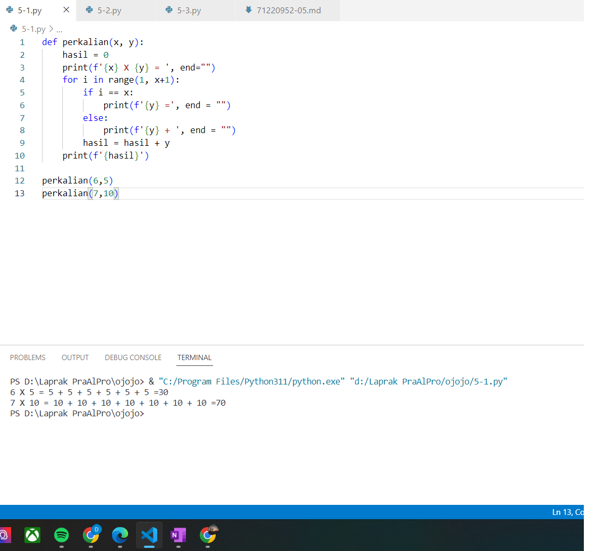
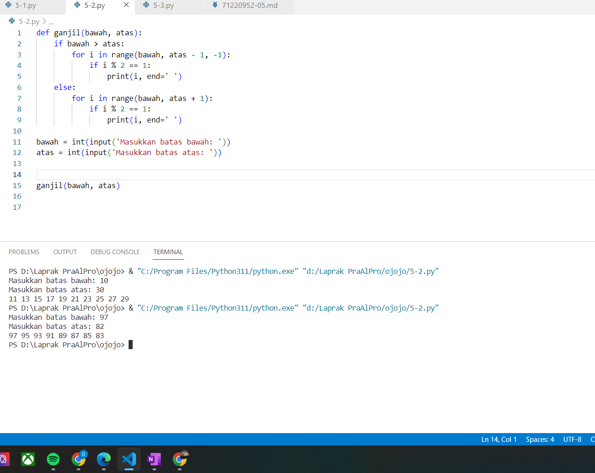
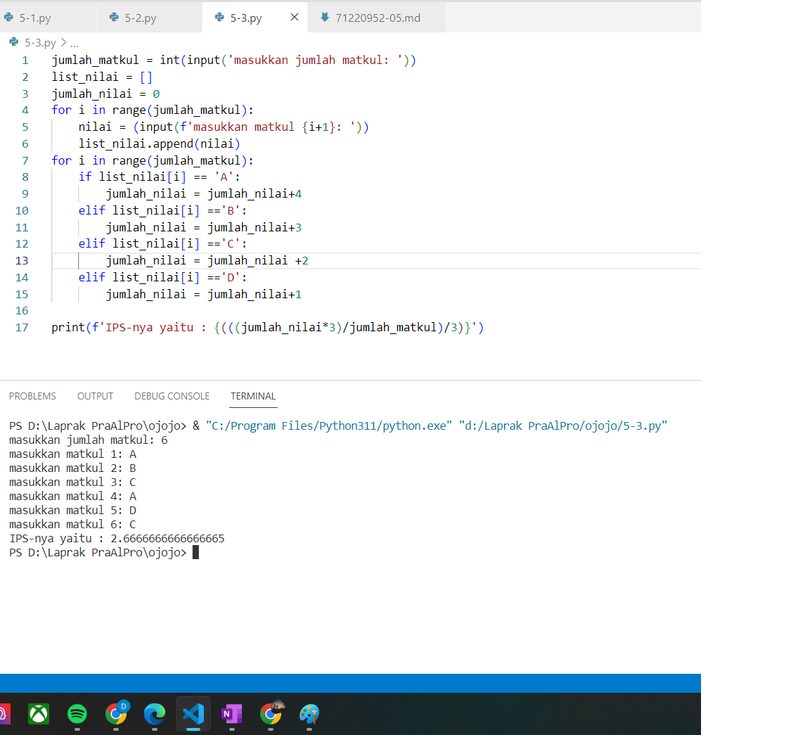

# Laporan Praktikum Algoritma dan Pemrograman

## Jawaban no. 1:
def perkalian(x, y):
    hasil = 0
    print(f'{x} X {y} = ', end="")
    for i in range(1, x+1): 
        if i == x:
            print(f'{y} =', end = "")
        else:
            print(f'{y} + ', end = "")
        hasil = hasil + y
    print(f'{hasil}')

perkalian(6,5)
perkalian(7,10)

Pada soal 5.1  yang membuat fungsi perhitungan perkalian tettpi menggunakan penjumlahan, disini menggunakan fungsi def dan variable x, y untuk mewakili atau memanggil fungsi yang ada. Pertama kita menggunakan percabangan yang menggunakan def lalu variable hasil didefinisikan dengan nilai 0. lalu print dengan menggunakan string(f) untuk mencetak nilai dalam format string degan awalnya menggunakan kurung kurawal dan menggunakan parameter end="," hal ini untuk membuat hasil print menjadi satu baris kesamping bukan kebawah. Setelah itu baru menggunakan perulangan for dengan start 1 dan stop x+1. lalu menggunakan if-else, jika(if) nilai i sudah sama dengan x maka akan di print dengan format string dan parameter end=",". Tetapi jika i belum sama dengan x maka tanda + akan dicetak pada format string dan parameter end= "" supaya nilai yang dicetak dipisahkan.

## Jawaban no. 2:
def ganjil(bawah, atas):
    if bawah > atas:
        for i in range(bawah, atas - 1, -1):
            if i % 2 == 1:
                print(i, end=' ')
    else:
        for i in range(bawah, atas + 1):
            if i % 2 == 1:
                print(i, end=' ')

bawah = int(input('Masukkan batas bawah: '))
atas = int(input('Masukkan batas atas: '))

ganjil(bawah, atas)

Pada soal 5.2 yang membuat fungsi ganjil. Pertama kita menggunakna fungsi def dan paramater atas dan bawah lalu menggunakan if-else, pada if untuk memeriksa bawah lebih besar dari atas atau tidak. Lalu menggunakan perulangan for, jika bawah lebih besar dari atas maka start akan dimulai dari bawah, stop atas-1, step  -1 atau minus 1. jika (IF) i dimodulo 2 hasilnya bilangan ganjil maka akan dicetak 1 dan parameter end=",". Tetapi jika else atau bawah lebih kecil sama dengan atas maka start akan dimulai dari bawahdan stop atas+1 dan jika I dimodulo 2 hasilnya 1 dan bilangan ganjil maka akan print dan parameter end=",". Lalu masukkan input untuk meminta input dari pengguna dan ganjil adalah untuk memanggil fungsi

## Jawaban no. 3:
jumlah_matkul = int(input('masukkan jumlah matkul: '))
list_nilai = []
jumlah_nilai = 0
for i in range(jumlah_matkul):
    nilai = (input(f'masukkan matkul {i+1}: '))
    list_nilai.append(nilai)
for i in range(jumlah_matkul):
    if list_nilai[i] == 'A':
        jumlah_nilai = jumlah_nilai+4
    elif list_nilai[i] =='B':
        jumlah_nilai = jumlah_nilai+3
    elif list_nilai[i] =='C':
        jumlah_nilai = jumlah_nilai +2
    elif list_nilai[i] =='D':
        jumlah_nilai = jumlah_nilai+1

print(f'IPS-nya yaitu : {(((jumlah_nilai*3)/jumlah_matkul)/3)}')

Pada soal 5.3 membuat program penghitung nilai indeks prestasi semester. Pertama kita harus membuat input dan menggunakan integer. Lalu membuat list kososng yang berguna untuk menyimpan nilai dari setiap matkul yang ada. Lalu menggunakan perulangan for dari 0 sampai jumlah matkul dan setiap berjalan, maka akan memasukkan input dan nilai yang dimasukkan akan disimpan dalam variable dan ditambahkan ke list nilai dan menggunakan fungsi append. Setelah itu menggunakan percabangan if-elif-else. Jika nilai A maka akan ditambahkan 4 dan jika B maka ditambah 3, jika C maka ditambah 2,, jika D maka ditambah 1. setelah perulangan selesai maka akan print IPS dan menghitung rata-rata jumlah nilai dibagi jumlah matkul  menggunakan format string(f)
~~~

~~~

Bagaimana jika ingin menampilkan gambar?  Pastikan anda meletakkan file di folder yang sama dengan file ini.  

## Pernyataan integritas
### Tulis nama lengkap dan NIM anda pada tempat yang disediakan

Dengan ini, **Debora Lintang Kusumaningrum** dengan NIM **71220952** menyatakan bahwa laporan praktikum ini saya buat sendiri tanpa kecurangan dalam bentuk apapun.  Jika terbukti melakukan kecurangan, maka saya bersedia mendapatkan penalti nilai berupa nilai laporan praktikum secara keseluruhan (dari 14 pertemuan) menjadi nol.